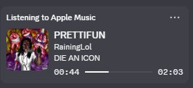
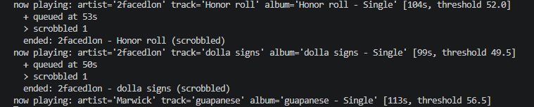

# AppleMusicScrobbler

Scrobbles Apple Music to Last.fm on Windows. Also shows what you're listening to on Discord.

Apple Music doesn't scrobble, and Apple doesn't expose a listening-history API, so there's no way to do this from a server. This reads playback off the Windows media-session bus instead, the same one the volume overlay uses, and submits the scrobbles itself. Three Python files, running on your machine.

## Setup

You need Windows 10 or 11, Apple Music from the Microsoft Store (not iTunes), Python 3.9 or newer, and a Last.fm account.

    git clone https://github.com/osfv/AppleMusicScrobbler
    cd AppleMusicScrobbler
    py -m pip install -r requirements.txt

Use `py -m pip` rather than plain `pip`, otherwise the packages can land in a different interpreter than the one running the script.

Get an API key from https://www.last.fm/api/account/create, then copy `.env.example` to `.env` and fill in the key and secret.

    py scrobbler.py

The first run opens a browser to authorize. Press Enter in the terminal once you've done that. The session gets saved to `session.json` and reused, so it only happens once. Leave the window open while you listen.

## Discord

Optional. Leave `DISCORD_CLIENT_ID` empty to skip it.

Make an application at https://discord.com/developers/applications and name it `Apple Music`. The name matters, it's what shows up after "Listening to". Under Rich Presence > Art Assets, upload a square PNG called `applemusic`, used when no cover art can be found. Put the Application ID in `.env`.

This talks to the local Discord RPC socket. It isn't a bot and doesn't touch your account token. Canary and PTB both work.

Worth saying up front: the green Spotify card is a first-party integration and nobody can reproduce it. This is Rich Presence with activity type 2. It looks close, but there's no Listen Along and there won't be.

## Metadata

Apple Music on Windows reports track info in a way that produces garbage scrobbles if you submit it as-is, so a good chunk of the code is cleanup.

It puts `Artist - Album` in the artist field and leaves the album field empty, so that gets split back apart. Any dash variant, since it isn't consistent about which one it uses.

It also reports the whole credit as the artist, like `1300SAINT & Nine Vicious`. That isn't a real artist on Last.fm, so scrobbling it creates a dead artist page and the play counts for neither person. The credit gets split and only the primary artist is submitted.

The catch is that splitting on `&` would also turn `Earth, Wind & Fire` into `Earth`. So before splitting anything it asks Last.fm whether it recognizes the combined name, and leaves the credit alone if it does. Results are cached, so it's one request the first time a given collaboration comes up.

Cover art has the same problem. Discord needs a URL, so art is looked up by name, and a plain search is wrong more often than you'd think. Looking up a track called `lol` returns KIDZ BOP. Every result is checked against the artist before it's used, and when the obvious searches fail it pulls the artist's whole catalogue and matches the title locally, which is the only thing that reliably finds generic titles by small artists.

You can test a lookup without running the scrobbler:

    py presence.py "Rich Amiri" "Never Have I"

## When it scrobbles

It polls once a second and only counts time while playback is actually running, so skipping to the end of a track doesn't earn a scrobble.

| Rule | Value |
| --- | --- |
| Minimum track length | 30 seconds |
| Scrobble point | half the duration, or 4 minutes, whichever comes first |
| Now Playing | sent on every track change |
| Batch size | up to 50 per submission |
| Timestamp | UTC unix time at playback start |

Replays are caught by watching for the position going backwards while the track info stays the same.

## Troubleshooting

| Symptom | Cause |
| --- | --- |
| Nothing detected | Apple Music has to be playing, not just open. Run `py probe.py` to see what Windows reports. |
| Chrome shows up in the probe | Normal, browsers publish media sessions too. They're filtered out by AUMID. |
| Card says "Playing" instead of "Listening to" | Old copy of `presence.py`. |
| Grey dice instead of cover art | Lookup found nothing and there's no `applemusic` asset uploaded. |
| `discord: not connected` | Discord desktop isn't running. Browser Discord has no RPC socket. |
| `py presence.py` does nothing | It's a module, not the entry point. Run `py scrobbler.py`. |

## Security

`session.json` holds a Last.fm session key that doesn't expire and can scrobble and edit your library. It's in `.gitignore`, but don't commit it. If you do, revoke it at https://www.last.fm/api/accounts, since removing the commit doesn't help once it's been pushed.

Nothing else leaves your machine. The only outbound requests are to Last.fm and to the iTunes search endpoint for cover art.

## Limitations

Windows only. The capture layer is a Windows API and there's no equivalent path here for macOS or Linux.

Unsent scrobbles are kept in memory, so anything queued is lost if the process dies. Failed submissions retry while it's running, but that's as far as it goes.

No tray icon or autostart yet, it's a console window you leave open. The plan is to port it to a C# tray app, persist the queue properly, and move the session key into DPAPI.

Art still misses occasionally on releases that aren't in either catalogue.

## License

MIT
